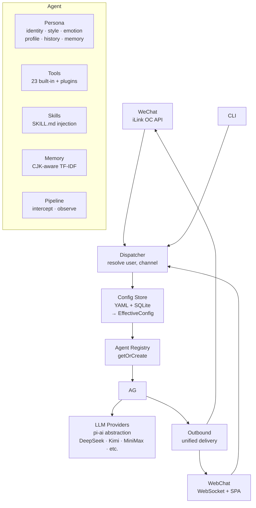

# Vex

General-Purpose AI Agent Framework — Persona-Driven, Multi-Channel, Tool-Native

[](https://github.com/counhopig/vex-bot)
[](LICENSE)
[](https://nodejs.org)

Vex is a TypeScript ESM agent framework built on `@mariozechner/pi-coding-agent` and `@mariozechner/pi-ai`. It connects to personal WeChat, runs in the browser via a server-rendered WebChat UI, and supports Chinese LLM providers alongside OpenAI/Anthropic-compatible APIs. Forked from [OpenMozi](https://github.com/oujingzhou/openmozi) (Apache 2.0).

> `src/` was rewritten from scratch — TDD, class-based, no process-global state bleeding across instances — starting from commit `dfb0411`. A small number of security-critical routines (SSRF guards, timing-safe auth, path-traversal checks, atomic writes) were carried forward from the prior implementation rather than redesigned. See [`AGENTS.md`](AGENTS.md) for the technical deep dive (module map, message-processing flow, conventions, known gaps).

**Vex is not just a chatbot.** It's a general agent framework where **Persona defines identity**, tools provide capabilities, and a unified Dispatcher routes every message — regardless of channel — through the same pipeline.

---

## Design

Vex is built on three pillars:

| Pillar | Role |
|--------|------|
| **Persona** | The agent's identity. Who it is, how it behaves, what it remembers. The system prompt starts here. |
| **Tools** | What the agent can do. File I/O, bash, browser, web search, memory — 23 built-in tools plus plugins. |
| **Channels** | Where messages come from and go to. WeChat, WebChat, CLI. Pure I/O, no business logic. |

```
Message → Dispatcher → Agent { Persona + Tools + Memory + Skills } → Outbound
                           ↑
                     EffectiveConfig(user, channel)
                           ↑
              YAML (system) + SQLite (user override)
```

Every message takes the same path. No shortcuts, no divergence. Persona and Skills are opt-in — see [Configuration](#configuration).

---

## Features

- **Persona-first architecture** — identity, reply style, emotion, profile building, memory directives; opt-in, not bolted onto a hardcoded default identity
- **Multi-channel** — personal WeChat (iLink OC API long-polling), WebChat (WebSocket SPA), CLI
- **Multi-user** — each user gets their own Agent, Persona state, Memory, Sessions, and WeChat account; zero cross-user state leakage
- **Chinese model coverage** — DeepSeek, MiniMax, Kimi (Moonshot), Doubao (ByteDance), Zhipu, LongCat, StepFun, ModelScope, DashScope, plus custom OpenAI/Anthropic-compatible providers and Western backends (OpenAI, Ollama, OpenRouter, Together, Groq, vLLM)
- **23 built-in tools** — file read/write/edit/glob/grep, bash execution, web search/fetch, memory management (4), cron scheduling (5), weather, image analysis, system utilities (time/calculator/delay), plus an opt-in browser-automation tool
- **CJK-native memory** — TF-IDF long-term memory with bigram tokenization for Chinese, Japanese, and Korean
- **Skills injection** — SKILL.md system (YAML frontmatter + Markdown body) parsed and injected at runtime; opt-in, same as Persona
- **3-tier plugin architecture** — bundled (`dist/`) → user-level (`~/.vex/`) → workspace (`./.vex/`) auto-discovery with lifecycle hooks
- **Cron scheduling** — `at`, `every`, and standard cron expressions; triggers agent turns on schedule
- **Playwright browser automation** — screenshots, form filling, web interaction via headless Chromium (opt-in)
- **Event hook system** — 8 event types with registration and unsubscribe support
- **YAML + SQLite config** — system defaults in YAML, per-user overrides in SQLite, resolved at runtime

---

## Architecture



| Module | Location | Role |
|--------|----------|------|
| Dispatcher | `src/dispatcher/` | Single entry point: resolve (user, channel) → Agent |
| Agent | `src/agent/` | Core: Persona + Tools + Skills + Memory + Pipeline |
| Persona | `src/agent/persona/` | Identity, emotion, profile facts, memory directives — system prompt base |
| Tools | `src/tools/` | LLM-callable capabilities, scoped per Agent |
| Skills | `src/skills/` | SKILL.md parsing and prompt injection |
| Memory | `src/memory/` | CJK-aware TF-IDF long-term memory, per-user scoped |
| Pipeline | `src/agent/Pipeline.ts` | Per-Agent message interceptors and response observers |
| Channels | `src/channels/` | Protocol adapters (WeChat OC API, WebSocket), pure I/O |
| Outbound | `src/outbound/` | Cross-channel unified message delivery |
| Config | `src/config/` | YAML loading + Zod validation, merged with SQLite overrides |
| Providers | `src/providers/` | LLM model resolution, API key management |
| Cron | `src/cron/` | at/every/cron schedule dispatching |
| Plugins | `src/plugins/` | 3-tier auto-discovery + lifecycle management |
| Browser tool | `src/tools/builtin/browser.ts` | Playwright headless browser automation (opt-in) |
| Hooks | `src/hooks/` | Event hook system |
| Sessions | `src/sessions/` | JSONL session persistence, per-user scoped |
| Web UI | `src/web/` | Server-rendered WebChat + control panel + auth |

> See [`AGENTS.md`](AGENTS.md) for detailed module contracts, data flow, and design decisions.

---

## Quick Start

### Install

```bash
npm install -g vex-bot
vex --version
```

### Configure

```bash
vex onboard
```

The interactive configuration wizard walks you through: model providers, channels (personal WeChat), agent parameters, server port, and persona settings.

Config is stored at `~/.vex/config.local.yaml`. Per-user overrides are stored in SQLite (`web_user_settings`) and managed via the Web control panel.

### Start

```bash
# Full startup (WebChat + WeChat)
vex start

# WebChat only
vex start --web-only
```

Open `http://localhost:PORT` for the WebChat interface. Health check: `GET /health`.

---

## CLI Commands

| Command | Description |
|---------|-------------|
| `vex onboard` | Interactive configuration wizard |
| `vex start` | Start gateway (`--web-only` for WebChat only, `-p` for port) |
| `vex status` | Service status and health |
| `vex logs` | View logs (`-f` tail, `-n` lines, `--level` filter) |
| `vex chat` | Terminal chat test (`-m` model, `-p` provider) |
| `vex check` | Validate configuration |
| `vex models` | List configured models |
| `vex kill` | Stop running service |
| `vex restart` | Restart service |

---

## Configuration

`config.local.yaml` — copy [`config.example.yaml`](config.example.yaml) to get started; it's the annotated source of truth for every field, its real default, and which sections also accept per-user overrides via the Web control panel (SQLite). The essentials:

```yaml
providers:
  deepseek:
    apiKey: sk-xxx

agent:
  defaultProvider: deepseek
  defaultModel: deepseek-chat

# Opt-in: omitting this whole block disables Persona, not just `enabled: false`.
persona:
  persona_name: PandaBot
  persona_base_prompt: |
    你是一个友好、专业、乐于助人的 AI 助手。
  persona_reply_style: |
    用自然流畅的中文回复，适度使用 emoji。

channels:
  weixin:
    enabled: true

server:
  port: 3000
  host: 127.0.0.1  # loopback by default; only bind 0.0.0.0 behind a TLS-terminating proxy

webAuth:
  enabled: true
```

**Config resolution**: built-in defaults → `config.local.yaml` (system) → SQLite `web_user_settings` (per-user override, set via the Web control panel). `persona`, `skills`, `sharelink`, and `skillLearner` are opt-in extensions — the section must be present (even empty) to turn the feature on; see `config.example.yaml` for exactly which sections behave this way versus which default on.

---

## Project Structure

```
.
├── src/
│   ├── agent/           # Agent core: Persona, Tools, Skills, Memory, Pipeline
│   ├── dispatcher/      # Message routing: resolve (user, channel) → Agent
│   ├── channels/        # Protocol adapters: WeChat (iLink OC), WebChat (WebSocket)
│   ├── tools/           # Tool registration, validation, execution (23 built-in)
│   ├── memory/          # CJK-aware TF-IDF long-term memory, per-user
│   ├── skills/          # SKILL.md parsing and prompt injection
│   ├── providers/       # LLM model resolution (pi-ai wrapper)
│   ├── config/          # YAML config loading + Zod validation + SQLite merge
│   ├── outbound/        # Cross-channel unified message delivery
│   ├── cron/            # at/every/cron scheduling
│   ├── plugins/         # 3-tier plugin discovery (bundled/global/workspace)
│   ├── web/             # Server-rendered WebChat SPA + control panel + auth
│   ├── hooks/           # Event hook system (8 event types)
│   ├── sessions/        # JSONL session persistence
│   ├── cli/             # Commander.js CLI (9 subcommands)
│   ├── vendor/          # Vendored dependencies used directly by the runtime
│   └── utils/           # Logger, path helpers
├── skills/              # Built-in skills
├── tests/               # Vitest tests
└── config.example.yaml
```

---

## Development

```bash
npm install
npm run build

# Dev mode (TSX auto-restart)
npm run dev

# Tests (non-watch)
npm test

# Tests in watch mode
npm run test:watch

# Start Gateway directly (bypass CLI)
npm run start:gateway
```

### Conventions

- **Strict TypeScript**: `noUncheckedIndexedAccess`, `noImplicitReturns`, `noFallthroughCasesInSwitch` enabled
- **ESM only**: `"type": "module"`, NodeNext module resolution, `.js` extensions in imports
- **Zod validation**: config schemas are defined in `src/config/schema.ts`
- **Pino logging**: `getChildLogger("moduleName")` pattern for structured, namespaced loggers
- **Node >= 24**: minimum supported runtime

---

## Documentation

Everything beyond this README lives in [`AGENTS.md`](AGENTS.md) — module map, message-processing flow, conventions, and known gaps.

## License

[Apache-2.0](./LICENSE)

---

**Repository**: [https://github.com/counhopig/vex-bot](https://github.com/counhopig/vex-bot)
